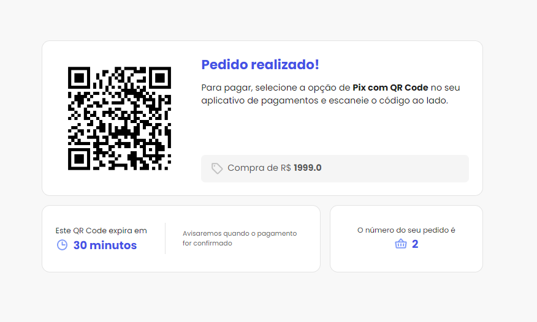
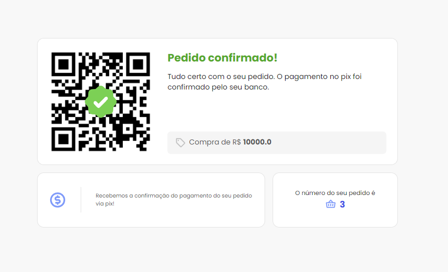
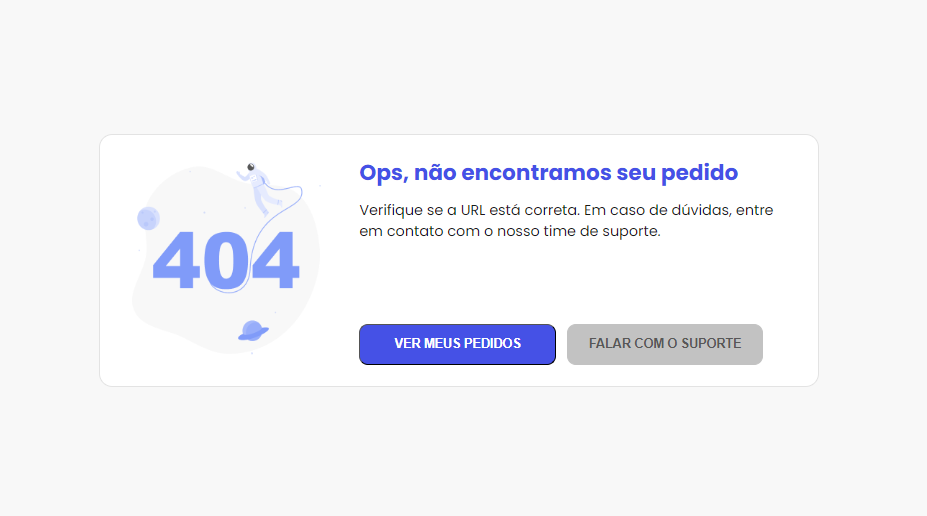

# QR Code Payment with Websockets

This project is a web application that allows for the creation and confirmation of payments using QR codes and the Pix system. The application is developed using Flask and WebSockets to provide real-time updates on payment status.

## Screenshots

Order Payment Page 

Confirmed Payment Page 

Payment Not Found Page 

